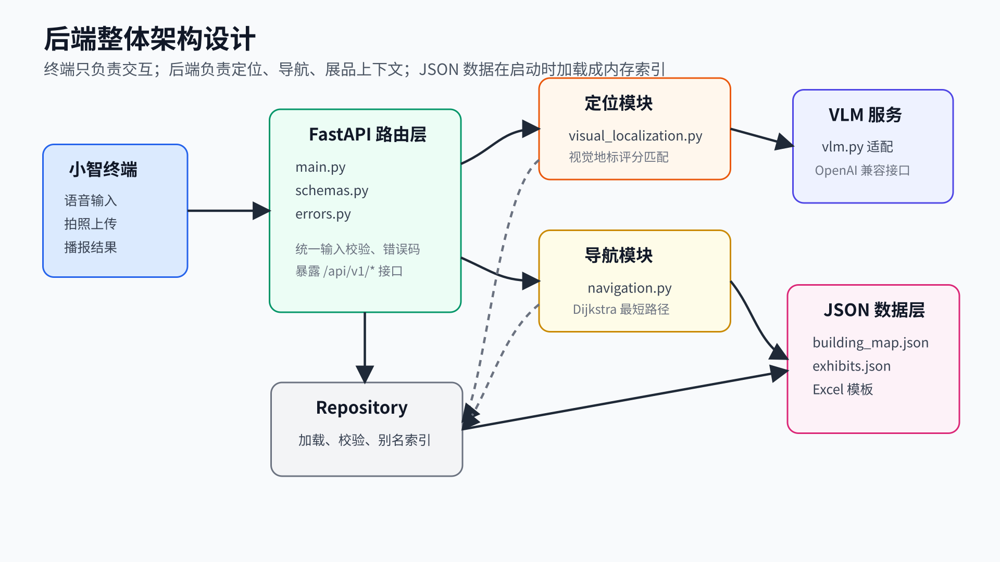
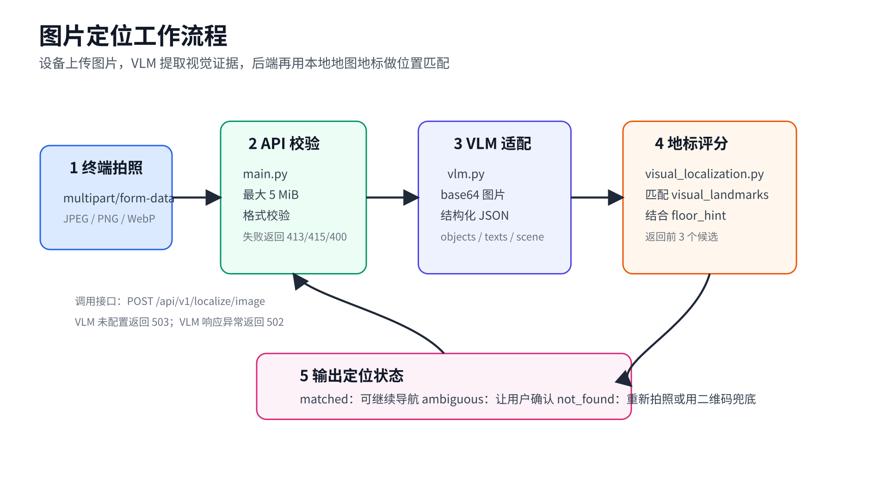
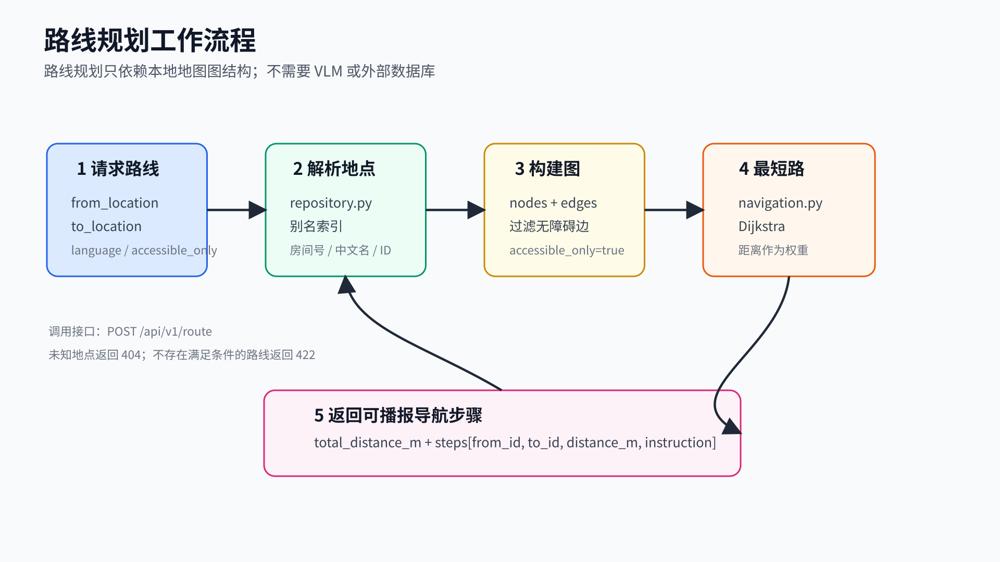
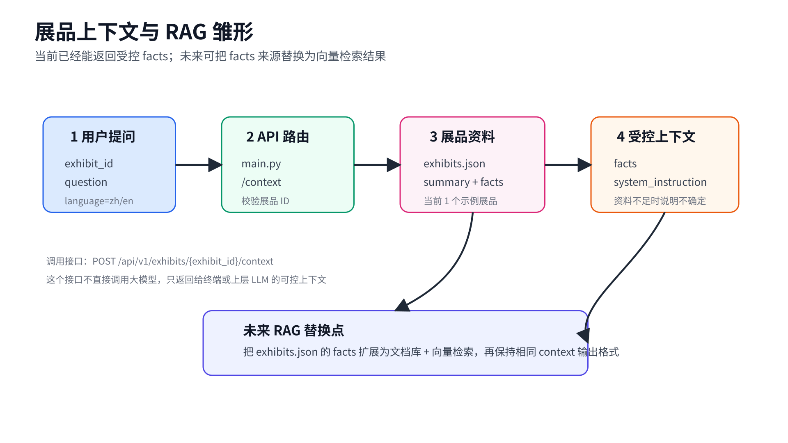
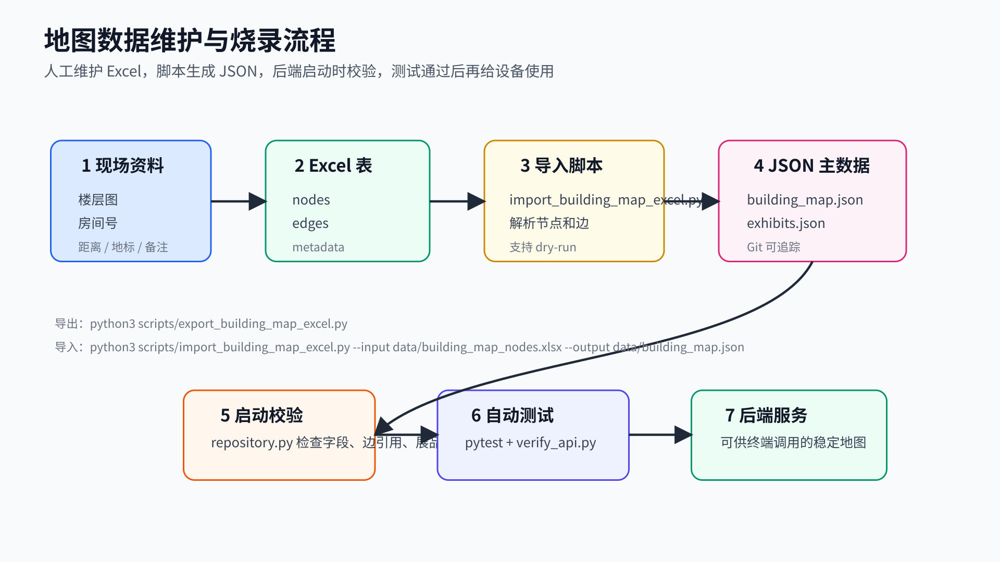

# 后端在项目中的位置

- 小智 ESP32-S3 终端负责语音、拍照和播报
- FastAPI 后端负责位置解析、路线规划和展品上下文
- 外部 VLM 服务负责从照片中提取可定位视觉特征
- 当前仓库维护后端与数据；固件源码位于 `Project-2`

```text
Terminal -> FastAPI Backend -> JSON Data
                       |
                       -> OpenAI-compatible VLM
```

# 架构总览图

{width=125%}

# 运行时架构

- `server/app/main.py`：FastAPI 应用和 API 路由
- `repository.py`：加载 JSON，校验数据，构建别名索引
- `navigation.py`：基于 Dijkstra 的最短路径规划
- `visual_localization.py`：基于视觉地标的规则评分定位
- `vlm.py`：OpenAI 兼容 VLM 请求适配器
- `schemas.py`：Pydantic 请求和响应模型
- `errors.py`：业务错误类型

# 请求处理流程

- `/api/v1/localize`：二维码或地点 ID -> 标准节点
- `/api/v1/localize/image`：图片 -> VLM -> 结构化视觉证据 -> 地点候选
- `/api/v1/route`：起点和终点 -> 图搜索 -> 分段导航指令
- `/api/v1/exhibits/{id}/context`：展品 ID + 问题 -> 可供 LLM 使用的事实上下文
- `/api/v1/resolve`：房间号、中文名、英文名、别名 -> 节点 ID

# 图片定位数据流

{width=125%}

# 路线规划数据流

{width=125%}

# 数据层不是外部数据库

- 当前没有 MySQL、PostgreSQL、SQLite 或向量数据库
- 数据主存储是仓库内 JSON 文件
- 服务启动时一次性加载到内存，并构建运行时索引
- 可用 `MUSEUM_DATA_DIR` 替换数据目录
- 启动阶段会校验节点、边、展品和视觉地标

```text
data/building_map.json -> 地图图结构
data/exhibits.json     -> 展品资料
data/building_map_nodes.xlsx -> 人工维护表
```

# 地图数据库内容

- 建筑：龙宾楼，当前覆盖 4 楼
- 楼层外轮廓：约 70 m x 80 m
- 坐标系：平面图左上角为原点，单位为米
- 节点数：124
- 边数：129
- 展品数：1
- 当前坐标、距离和视觉地标来自楼层索引图估算，仍需现场校准

# 节点类型统计

- 房间：89
- 走廊节点：12
- 消防栓：12
- 楼梯：4
- 卫生间：2
- 茶水间：2
- 电梯：1
- 货梯：1
- 当前位置标记：1

# 节点与边的数据结构

节点字段：

- `id`、`name_zh`、`name_en`、`floor`、`kind`
- `aliases`：房间号、中文别名、英文别名
- `position`：`x_m`、`y_m`
- `visual_landmarks`：视觉匹配别名和权重
- `remark`：数据备注

边字段：

- `from`、`to`、`distance_m`
- `bidirectional`、`accessible`
- `instructions.forward/reverse.zh/en`

# 导航能力

- 支持节点 ID、房间号和别名作为起点/终点
- 使用 Dijkstra 计算最短路径
- 支持普通路线和无障碍路线
- `accessible_only=true` 时会排除不可无障碍通行的边
- 支持中文和英文导航指令
- 起点等于终点时返回 0 米、0 步

# 视觉定位能力

- 图片上传限制：JPEG、PNG、WebP，最大 5 MiB
- VLM 配置项：`VLM_BASE_URL`、`VLM_API_KEY`、`VLM_MODEL`
- VLM 只提取客观视觉证据，不直接猜地点
- 后端用视觉地标和楼层提示计算候选地点
- 返回状态：`matched`、`ambiguous`、`not_found`
- 低置信度或候选接近时要求用户确认

# 展品与 RAG 关系

- 当前 `exhibits.json` 是轻量展品知识库
- 已有示例展品：`ROBOT-001`
- 当前关联地点：`LB-4F-ROOM-400`
- 展品资料包含中英文简介和 facts
- `/context` 返回 facts 和回答约束
- 还没有真正接入向量库或完整 RAG 检索管线

# 展品上下文数据流

{width=125%}

# API 功能清单

- `GET /health`：服务健康检查
- `GET /api/v1/places`：地点列表
- `POST /api/v1/localize`：二维码或 marker 定位
- `POST /api/v1/localize/visual`：结构化视觉证据定位
- `POST /api/v1/localize/image`：图片定位
- `POST /api/v1/route`：路线规划
- `GET /api/v1/exhibits`：展品列表
- `GET /api/v1/exhibits/{id}`：展品详情
- `POST /api/v1/exhibits/{id}/context`：展品问答上下文
- `GET /api/v1/resolve`：地点别名解析

# 运维与数据维护工具

- `scripts/export_building_map_excel.py`：JSON -> Excel
- `scripts/import_building_map_excel.py`：Excel -> JSON
- `scripts/verify_api.py`：端到端接口检查
- `tests/`：21 项自动化测试
- FastAPI 自动文档：`/docs` 和 `/openapi.json`
- 旧演示数据脚本已移到 `scripts/legacy/`

# 地图数据维护流

{width=125%}

# 当前限制与下一步

- 4 楼数据可跑通流程，但不是现场测绘精度
- 展品资料仍是占位内容，需要替换为真实策展资料
- VLM 服务需要在部署环境中配置 API Key
- 尚未加入鉴权、速率限制和持久化日志
- 尚未接入真正 RAG 文档库
- 需要部署到公网 HTTPS 后，才能供 ESP32 终端稳定调用

# 结论

- 后端主链路已经具备：定位、导航、展品上下文
- 数据层已经从演示数据升级为 4F 图结构
- 当前“数据库”是 JSON 图数据和展品 facts
- 可通过 Excel 维护地图，再烧录回 JSON
- 下一阶段重点是现场校准、真实展品资料、VLM 联调和云部署
