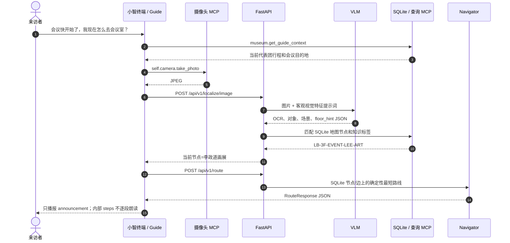

# 例子一：从李政道画展前往会议室

## 用户场景

用户说：“时间快到了，会议快开始了，我现在怎么去会议室？”终端没有可信的当前位置，因此自动拍照。照片中识别到“李政道科学与艺术大奖赛历年主题画展”，系统据此定位三楼画展区域，再读取代表团任务中的会议室节点并请求路线。

## 调用流程



## 定位上传

```http
POST /api/v1/localize/image
Content-Type: multipart/form-data

image=<JPEG二进制>
floor_hint=3
```

VLM 应返回客观证据，不直接决定位置或路线：

```json
{
  "objects": [
    {"label": "大型画展展板", "confidence": 0.96},
    {"label": "连续排列的艺术作品", "confidence": 0.91}
  ],
  "recognized_texts": [
    "李政道科学与艺术大奖赛",
    "历年主题画展"
  ],
  "scene_description": "室内走廊北侧分布着连续的科学与艺术主题展板",
  "floor_hint": 3
}
```

知识/地图节点查询：

```json
{
  "jsonrpc": "2.0",
  "id": 3,
  "method": "tools/call",
  "params": {
    "name": "museum.search_knowledge",
    "arguments": {
      "q": "李政道科学与艺术大奖赛历年主题画展",
      "floor": 3,
      "include_archived": false
    }
  }
}
```

相关节点为 `LB-3F-EVENT-LEE-ART`。

## 路线请求

```json
{
  "from_location": "LB-3F-EVENT-LEE-ART",
  "to_location": "LB-3F-ROOM-300",
  "language": "zh",
  "accessible_only": false
}
```

成功路线返回结构：

```json
{
  "from_id": "LB-3F-EVENT-LEE-ART",
  "to_id": "LB-3F-ROOM-300",
  "total_distance_m": 82.3,
  "announcement": "300会议室就在您所在的三楼，位于电梯出口附近。",
  "steps": [
    {
      "from_id": "LB-3F-EVENT-LEE-ART",
      "to_id": "LB-3F-OPEN-02",
      "distance_m": 4.4,
      "instruction": "前进 4.4 米到达3楼开放空间 02。"
    },
    {
      "from_id": "LB-3F-OPEN-02",
      "to_id": "LB-3F-PATH-NORTHEAST",
      "distance_m": 11.5,
      "instruction": "前进 11.5 米到达3楼绿色路线转折点。"
    },
    {
      "from_id": "LB-3F-PATH-NORTHEAST",
      "to_id": "LB-3F-OPEN-09",
      "distance_m": 18.1,
      "instruction": "前进 18.1 米到达3楼开放空间 09。"
    },
    {
      "from_id": "LB-3F-OPEN-09",
      "to_id": "LB-3F-PATH-SOUTHEAST",
      "distance_m": 28.2,
      "instruction": "前进 28.2 米到达3楼绿色路线转折点。"
    },
    {
      "from_id": "LB-3F-PATH-SOUTHEAST",
      "to_id": "LB-3F-OPEN-07",
      "distance_m": 10.5,
      "instruction": "前进 10.5 米到达3楼开放空间 07。"
    },
    {
      "from_id": "LB-3F-OPEN-07",
      "to_id": "LB-3F-ROOM-300",
      "distance_m": 9.6,
      "instruction": "前进 9.6 米到达300房间。"
    }
  ]
}
```

终端最终只播报：

> 300会议室就在您所在的三楼，位于电梯出口附近。

`steps` 仅供后台寻路、调试和重新定位使用，不会把六个内部节点逐段念给来宾。该路线来自 `output/longbin-1f-4f-node-route.pdf` 中的绿色可通行标注。它绕行中央楼梯结构，不把绿色楼梯线当作同层捷径。距离按图纸比例估算，校准状态为 `user_marked`，只用于路线排序；路线由 SQLite 中已经确认的节点和连线计算，VLM 只提供定位证据。

## 安全行为

- 代表团任务没有明确会议室节点时，Guide 必须询问或提示工作人员，不能猜测目的地。
- 定位结果不明确时不开始路线播报。
- 地图中没有已确认的连线时返回“路线尚未录入”，不能穿过墙体推测路线。
- 导航途中在关键路口重新拍照，并从新的可信节点规划剩余路线。
