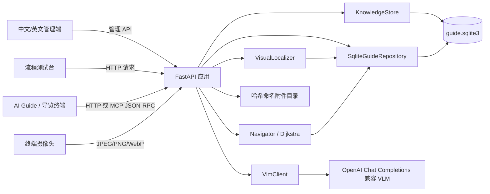
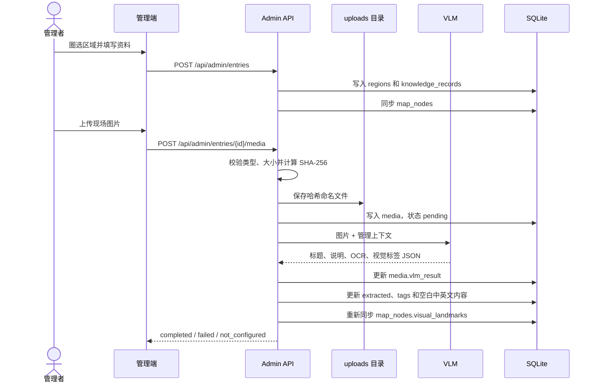
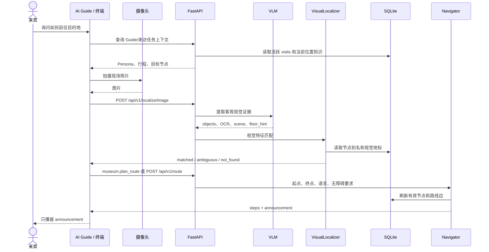

# 龙宾楼 VLM 智能导览系统架构技术文档

> 文档版本：1.0
> 对应后端版本：1.0.0
> 更新日期：2026-07-16
> 项目目录：`/home/Hylia/workspace/BackEnd`

## 1. 文档目的

本文档描述龙宾楼 VLM 智能导览系统当前后端的技术架构、组件职责、数据模型、接口边界和主要业务流程，用于后续开发、终端联调、数据维护和现场部署。

当前项目主要用于在没有开发板的情况下模拟和验证以下能力：

- 管理龙宾楼四层楼的地图、学院资料、活动展览和来访任务；
- 通过管理端圈选地图区域并上传现场图片；
- 使用 VLM 将图片中的客观信息预处理为可检索的结构化数据；
- 通过照片、OCR 和视觉地标定位来宾所在位置；
- 基于 SQLite 中的地图节点和通行边计算确定性路线；
- 通过 HTTP 或 MCP 向 AI Guide 提供知识查询、来访上下文和路线规划能力；
- 将后台完整路线压缩为适合语音终端的一句式播报。

## 2. 系统边界

### 2.1 当前仓库包含

- FastAPI 后端服务；
- SQLite 数据库及数据初始化逻辑；
- 中文、英文管理端；
- 后端输入输出测试台；
- VLM 客户端和视觉特征匹配模块；
- 路线规划模块；
- MCP JSON-RPC 服务；
- Guide Persona 和工具契约；
- 自动化测试、端到端验证脚本和地图数据维护脚本。

### 2.2 当前仓库不包含

- 持续运行的大模型对话 Agent；
- ESP32-S3 摄像头、麦克风、扬声器的硬件驱动；
- 完整的多角色权限与集中审计平台；当前提供管理端 Basic Auth、设备/MCP Token 和本地变更历史；
- 生产环境反向代理、TLS 证书和集中日志系统。

最终的 AI Guide 可以运行在小智终端或其他 Agent 容器中，通过本项目的 `/mcp` 或 `/api/v1` 接口访问数据和导航能力。

## 3. 架构原则

系统当前遵循以下原则：

1. **VLM 只提取证据**：VLM 负责 OCR、物体、场景和视觉标签提取，不直接决定具体位置或路线。
2. **SQLite 是主要运行时数据源**：地图、知识、活动、附件索引和来访任务保存在统一数据库中。
3. **路线确定性计算**：路线由已录入节点和可通行边计算，不允许大模型推测墙体、出口或捷径。
4. **管理写入与 Guide 查询分离**：管理端负责写入，Guide 主要通过只读 HTTP/MCP 工具查询。
5. **完整路线与语音播报分离**：`steps` 用于后台调试和重新定位，`announcement` 用于来宾播报。
6. **归档代替物理删除**：知识、活动和错误节点通常通过归档退出默认查询，保留历史可追踪性。

## 4. 总体架构



系统采用单体服务架构。所有接口、静态网页、SQLite 访问、VLM 调用和导航计算运行在同一个 FastAPI 进程内，适合当前本机测试和可信局域网部署。

## 5. 技术栈

| 层级 | 技术 |
|---|---|
| 后端框架 | Python 3.11+、FastAPI |
| ASGI 服务 | Uvicorn |
| 数据校验 | Pydantic |
| 数据库 | SQLite |
| HTTP 客户端 | HTTPX |
| 管理端 | 原生 HTML、CSS、JavaScript、Canvas |
| AI 视觉接口 | OpenAI Chat Completions 兼容多模态接口 |
| AI 工具协议 | MCP 风格 JSON-RPC，协议版本 `2025-06-18` |
| 路线算法 | Dijkstra 最短路径 |
| 测试 | Pytest、HTTPX ASGITransport |

## 6. 代码结构与职责

```text
BackEnd/
├── data/
│   ├── guide.sqlite3
│   ├── building_map.json
│   ├── exhibits.json
│   ├── user_marked_routes_2026-07-16.json
│   └── elevator_navigation_2026-07-16.json
├── server/app/
│   ├── main.py
│   ├── admin_api.py
│   ├── mcp_api.py
│   ├── knowledge.py
│   ├── repository.py
│   ├── navigation.py
│   ├── visual_localization.py
│   ├── vlm.py
│   ├── guide_persona.py
│   ├── schemas.py
│   ├── floor_map_seed.py
│   └── static/
│       ├── admin/
│       └── flow_lab/
├── scripts/
├── tests/
├── Documents/
└── output/
```

### 6.1 应用装配层

`server/app/main.py` 是应用入口，负责：

- 创建 `KnowledgeStore`；
- 创建运行时 `SqliteGuideRepository`；
- 创建 `Navigator`、`VisualLocalizer` 和 `VlmClient`；
- 注册管理 API 和 MCP 路由；
- 挂载管理端、流程测试台和上传附件静态目录；
- 提供定位、图片定位、路线和展品上下文接口。

### 6.2 SQLite 数据访问层

`server/app/knowledge.py` 负责：

- 建表和兼容性迁移；
- 初始化四层地图、知识记录和路线修正；
- 知识、活动、来访任务的增删改查；
- 内容归档、恢复和版本历史；
- 附件元数据和 VLM 结果保存；
- 管理端记录与 `map_nodes` 的同步；
- 地图节点、路线边和楼层图查询。

`KnowledgeStore` 每次操作建立短生命周期 SQLite 连接，适合当前低并发本地部署。

### 6.3 导航数据仓库

`server/app/repository.py` 提供两种实现：

- `GuideRepository`：旧 JSON 数据加载器和数据校验基类；
- `SqliteGuideRepository`：当前运行时地图仓库，从 SQLite 读取有效节点和路线边。

`SqliteGuideRepository` 在地点解析、地点列表和展品查询前刷新数据，因此管理端保存后的节点可以被后续导航请求直接读取，不需要重启服务。

目前地图和路线已经以 SQLite 为运行时来源；旧专用展品接口仍从 `data/exhibits.json` 加载演示展品，这是后续需要消除的兼容层。

### 6.4 视觉定位模块

`server/app/visual_localization.py` 将 VLM 返回的客观视觉证据与地图节点的以下字段比较：

- `aliases`；
- `visual_landmarks`；
- OCR 文字；
- 场景描述；
- `floor_hint`。

模块返回三种状态：

- `matched`：存在足够明确的最佳节点；
- `ambiguous`：前两名候选分数过于接近，需要确认或重新拍照；
- `not_found`：没有足够匹配证据。

### 6.5 路线规划模块

`server/app/navigation.py` 将 `map_nodes` 和 `map_edges` 构造成图，并使用 Dijkstra 算法计算最短路线。

路线边支持：

- 距离权重；
- 双向或单向；
- 无障碍属性；
- 中英文正向、反向指令；
- 校准状态；
- 归档状态。

返回结构分为：

- `steps`：完整内部路线；
- `announcement`：最终面向来宾的简短播报。

当前禁入节点通过 `restricted`、`routable=false` 和 `guest_access=false` 表达业务语义，同时归档其连接边，使它无法进入来宾路线。需要注意，现有 Dijkstra 实现主要依据有效路线边构图，`routable` 还不是一个独立的算法过滤条件；后续新增禁入节点时必须同时确保没有有效连接边。

### 6.6 VLM 客户端

`server/app/vlm.py` 使用以下环境变量：

```bash
VLM_API_KEY
VLM_BASE_URL
VLM_MODEL
VLM_TIMEOUT_SECONDS
```

客户端支持 OpenAI Chat Completions 兼容地址，并对阿里云 Model Studio compatible-mode 地址进行适配。

VLM 当前用于两个场景：

1. 管理端上传图片的内容预处理；
2. 终端现场照片的视觉证据提取。

知识搜索和路线计算本身不会调用 VLM。

### 6.7 MCP 服务

`server/app/mcp_api.py` 实现 `/mcp` JSON-RPC 入口，支持：

- `initialize`；
- `tools/list`；
- `tools/call`。

当前工具包括：

| 工具 | 用途 |
|---|---|
| `museum.search_knowledge` | 查询学院、建筑、设施和展品资料 |
| `museum.get_place_info` | 查询地图节点绑定的资料 |
| `museum.search_events` | 查询当前或历史活动 |
| `museum.get_event` | 读取单个活动 |
| `museum.get_nearby_events` | 查询当前位置附近的有效活动 |
| `museum.get_visitor_context` | 读取活跃来访任务 |
| `museum.get_guide_context` | 组合 Persona、来访任务和当前位置资料 |
| `museum.search_map_nodes` | 搜索地图节点 |
| `museum.get_map_node` | 读取单个地图节点 |
| `museum.plan_route` | 计算确定性路线 |

### 6.8 管理端

管理端位于 `server/app/static/admin/`，提供中文和英文页面。前端使用 Canvas 在楼层底图上绘制：

- 管理者圈选的展览区域；
- 用户确认的绿色可通行路线；
- 当前正在圈选的新区域；
- 红色不可进入区域。

管理端写操作通过 `server/app/admin_api.py` 进入 SQLite，包括内容创建、编辑、归档、恢复、附件上传、VLM 重试和来访任务维护。

## 7. 数据模型

### 7.1 核心关系

```mermaid
erDiagram
    REGIONS ||--o{ KNOWLEDGE_RECORDS : contains
    KNOWLEDGE_RECORDS ||--o{ MEDIA : has
    KNOWLEDGE_RECORDS ||--o{ CHANGE_HISTORY : versions
    REGIONS ||--o| MAP_NODES : synchronized_as
    MAP_NODES ||--o{ MAP_EDGES : from
    MAP_NODES ||--o{ MAP_EDGES : to
    FLOOR_MAPS ||--o{ MAP_NODES : displays
    VISITS ||--o{ CHANGE_HISTORY : versions
```

### 7.2 表说明

| 表 | 关键内容 |
|---|---|
| `regions` | 节点 ID、楼层、地图多边形、区域编号、状态 |
| `knowledge_records` | 类型、标题、说明、标签、VLM 提取结果、版本、状态 |
| `media` | 文件名、内容类型、SHA-256、大小、VLM 状态和结果 |
| `visits` | 代表团、机构、国家、语言、目的、行程和播报脚本 |
| `change_history` | 实体类型、版本、操作、完整快照 |
| `floor_maps` | 楼层、底图 URL、尺寸、来源和校准状态 |
| `map_nodes` | 名称、别名、视觉地标、坐标、范围、导航说明、可路由状态 |
| `map_edges` | 起点、终点、距离、方向、无障碍属性、分段指令和校准状态 |

### 7.3 知识分类

`knowledge_records.kind` 当前支持：

- `permanent`：学院、建筑等长期信息；
- `event`：活动和临时展览；
- `exhibit`：常设展品；
- `facility`：电梯、洗手间、钢琴等设施信息。

来访者资料单独保存在 `visits`，避免把代表团任务和公共知识混在同一表中。

### 7.4 节点命名

管理端节点 ID 必须符合：

```text
LB-[1-4]F-[A-Z0-9-]+
```

示例：

```text
LB-1F-REGION-A
LB-3F-EVENT-LEE-ART
LB-3F-ROOM-300
LB-4F-ELEVATOR-GUEST
```

## 8. 管理端图片入库流程



### 8.1 文件规则

- 单个管理端附件最大 20 MiB；
- 图片支持 JPEG、PNG、WebP；
- 另外允许 PDF、TXT、CSV、JSON、XLSX 和 DOCX 保存；
- 只有图片会自动进入 VLM 处理；
- 文件使用 SHA-256 命名和去重；
- 同一知识记录重复上传相同文件返回 HTTP 409。

### 8.2 VLM 写入策略

VLM 返回内容保存在：

- `media.vlm_result_json`：单张图片的原始结构化结果；
- `knowledge_records.extracted_json`：按媒体 ID 聚合的结果；
- `knowledge_records.tags_json`：合并后的视觉标签；
- `map_nodes.visual_landmarks_json`：供后续现场定位使用。

系统不会用 VLM 自动覆盖管理者已经填写的主要内容。只有当英文标题、中文说明或英文说明为空时，才使用 VLM 建议补充；视觉标签会与已有标签合并。

## 9. 终端定位与导航流程



### 9.1 视觉定位请求

现场图片接口：

```http
POST /api/v1/localize/image
Content-Type: multipart/form-data

image=<JPEG/PNG/WebP>
floor_hint=3
```

单张现场定位图片最大 5 MiB。

### 9.2 路线请求

```json
{
  "from_location": "LB-1F-OPEN-08",
  "to_location": "LB-4F-REGION-F",
  "language": "zh",
  "accessible_only": false
}
```

路线响应：

```json
{
  "from_id": "LB-1F-OPEN-08",
  "to_id": "LB-4F-REGION-F",
  "total_distance_m": 38.1,
  "announcement": "学院介绍区域在四楼。请乘坐访客电梯到四楼，出电梯后右转，再右转，学院介绍在左侧。",
  "steps": [
    {
      "from_id": "LB-1F-OPEN-08",
      "to_id": "LB-1F-PATH-SOUTHEAST",
      "distance_m": 9.1,
      "instruction": "前进 9.1 米到达1楼绿色路线转折点。"
    }
  ]
}
```

`steps` 是后台数据，不应直接逐条朗读。终端默认只播报 `announcement`，并在必要的关键位置重新拍照定位。

## 10. 地图与电梯规则

当前地图底图位于：

```text
server/app/static/admin/maps/
```

地图初始化和校正数据包括：

- `data/building_map.json`：旧四楼路网导入来源；
- `data/user_marked_routes_2026-07-16.json`：用户绿色可通行路线；
- `data/elevator_navigation_2026-07-16.json`：访客电梯和禁入区域修正。

当前电梯规则：

- 四层访客电梯出口方向记录为朝北；
- 一楼西北侧原误标“洗手间”的位置已经归档；
- 该位置现在是 `restricted`、`routable=false`、`guest_access=false` 的禁用电梯区域；
- 管理端使用红色“不可进入”覆盖层显示；
- 路线规划不得向来宾推荐该电梯。

## 11. Guide Persona 与响应边界

`server/app/guide_persona.py` 保存 Guide 的身份、回答边界和工具契约。

主要规则包括：

- 只使用数据库返回的学院、建筑、活动和展品资料；
- 使用当前活跃来访任务中指定的语言、行程和脚本；
- 数据不足时明确说明资料不足；
- 定位或服务失败时停止猜测并提示联系工作人员；
- 只使用后端确定性路线；
- 不推荐禁入节点；
- 内部路线节点不直接播报；
- 跨楼层播报以访客电梯、目标楼层和关键转向为核心。

Persona 当前是供外部 AI Guide 读取的配置，不是一个在 FastAPI 进程内持续运行的 Agent。

## 12. HTTP 与 MCP 接口分层

### 12.1 管理写接口

管理写操作位于 `/api/admin`：

- 创建、编辑、归档和恢复知识记录；
- 上传附件和重试 VLM；
- 查询历史版本；
- 创建和归档来访任务。

### 12.2 Guide 只读查询接口

主要位于 `/api/v1`：

- 知识查询；
- 活动查询；
- 地图节点查询；
- Guide 上下文；
- 视觉定位；
- 路线规划。

### 12.3 MCP 接口

MCP `/mcp` 对常用只读能力进行工具化封装，使 AI Guide 不需要自行构造多个 HTTP 请求。

MCP 路线示例：

```json
{
  "jsonrpc": "2.0",
  "id": 1,
  "method": "tools/call",
  "params": {
    "name": "museum.plan_route",
    "arguments": {
      "from_location": "LB-3F-EVENT-LEE-ART",
      "to_location": "LB-3F-ROOM-300",
      "language": "zh"
    }
  }
}
```

## 13. 配置与部署

### 13.1 本地启动

```bash
python3 -m venv .venv
source .venv/bin/activate
pip install -r server/requirements-dev.txt
uvicorn server.app.main:app --host 0.0.0.0 --port 8000 --reload
```

### 13.2 常用入口

| 地址 | 用途 |
|---|---|
| `http://127.0.0.1:8000/admin` | 中文管理端 |
| `http://127.0.0.1:8000/admin/en` | 英文管理端 |
| `http://127.0.0.1:8000/flow` | 后端流程测试台 |
| `http://127.0.0.1:8000/docs` | OpenAPI 文档 |
| `POST http://127.0.0.1:8000/mcp` | MCP JSON-RPC |

### 13.3 VLM 环境变量

```bash
export VLM_API_KEY="API 密钥"
export VLM_BASE_URL="VLM 接口地址"
export VLM_MODEL="模型名称"
export VLM_TIMEOUT_SECONDS="45"
```

后端进程必须在能够读取这些变量的 Shell 环境中启动。API 密钥不得写入数据库、代码、Markdown 文档或日志。

## 14. 异常与降级策略

| 场景 | 行为 |
|---|---|
| VLM 未配置 | 附件仍保存，`vlm_status=not_configured` |
| VLM 调用失败 | 保存失败信息，`vlm_status=failed`，允许管理端重试 |
| VLM 返回非法 JSON | 拒绝作为定位证据或知识提取结果 |
| 定位结果模糊 | 返回 `ambiguous`，要求确认或重新拍照 |
| 没有定位结果 | 返回 `not_found`，不得猜测位置 |
| 未知地点 | HTTP 404 |
| 路线不存在 | HTTP 422 |
| 重复附件 | HTTP 409 |
| 非法附件类型 | HTTP 415 |
| 图片或附件过大 | HTTP 413 |

## 15. 安全设计与当前风险

### 15.1 已有措施

- VLM 密钥只从环境变量读取；
- 上传类型和大小受限；
- 文件使用哈希命名，避免直接使用用户文件名作为路径；
- Pydantic 校验节点 ID、楼层、语言和数据类型；
- SQLite 外键已启用；
- 归档数据默认不提供给 Guide；
- 禁入电梯不参与路线规划。

### 15.2 当前风险

- 管理端已支持环境变量控制的 HTTP Basic Auth，但没有多角色权限；
- 已提供 Docker、Caddy HTTPS 和设备 Token；Basic Auth 管理写接口仍需避免跨站暴露；
- SQLite 适合本机及低并发，不适合大规模并发写入；
- 上传文件目前保存在应用静态目录；
- VLM 错误信息需要继续避免泄露第三方接口细节；
- MCP 当前是项目内实现的 JSON-RPC 工具入口，正式接入不同 Agent 平台时仍需进行兼容性验证。

正式部署使用 Docker Compose、Caddy HTTPS、管理端 Basic Auth、设备 Token 和持久卷；部署者仍需定期备份 SQLite 与附件卷，并保管好环境变量。

## 16. 测试与验证

运行自动化测试：

```bash
.venv/bin/python -m pytest -q
```

运行端到端接口验证：

```bash
.venv/bin/python scripts/verify_api.py
```

当前基线：

- 46 项自动化测试通过；
- 27 项端到端 API 检查通过；
- 四层地图可从 SQLite、HTTP 和 MCP 查询；
- 例子一“李政道画展到 300 会议室”可以完成定位和路线返回；
- 一楼到四楼学院介绍区域可以通过访客电梯规划；
- 禁用电梯不会进入来宾路线。

测试目录：

```text
tests/test_api.py
tests/test_knowledge.py
tests/test_mcp.py
tests/test_navigation.py
tests/test_repository.py
tests/test_visual_localization.py
tests/test_vlm.py
```

## 17. 当前数据状态

截至本文档更新时间，SQLite 中包含：

- 4 张楼层底图；
- 336 个地图节点，其中 330 个当前有效；
- 208 条路线边记录，其中 179 条当前有效；
- 8 条知识记录；
- 8 个附件；
- 1 条来访任务；
- 17 条变更历史。

这些数量会随着管理端录入、归档和地图校正变化，不应被业务代码写死。

## 18. 已知限制与后续演进

### 18.1 现场数据仍不完整

- 部分路线距离来自图纸估算；
- 1—3 楼仍有房间门口和走廊连接尚未确认；
- 关键路口视觉地标需要现场多角度照片；
- C 区及后续活动需要录入权威中英文资料。

### 18.2 建议的演进顺序

1. 完成现场路线、门口、电梯出口和距离校准；
2. 将 `exhibits.json` 的旧展品数据完全迁移到 SQLite；
3. 为管理端增加登录、角色和操作审计；
4. 增加数据库备份、恢复和数据导出机制；
5. 将播报模板从硬编码逐步迁移为可管理的路线语义；
6. 接入 ESP32-S3 摄像头、语音输入和语音输出；
7. 在真实局域网环境验证 MCP/HTTP 超时、重试和断网降级；
8. 若并发和多终端规模扩大，再评估迁移到 PostgreSQL 和对象存储。

## 19. 架构总结

当前系统已经形成一条完整的本地导览闭环：

```text
管理端录入资料和图片
→ VLM 预处理并写入 SQLite
→ AI Guide 通过 MCP 查询资料和来访任务
→ 摄像头照片经过 VLM 转成客观视觉证据
→ VisualLocalizer 匹配 SQLite 地图节点
→ Navigator 根据 SQLite 路线图计算确定性路线
→ 返回后台 steps 和面向来宾的 announcement
→ 终端完成简短语音播报
```

这一架构将生成式 AI 限制在“视觉理解和语言交互”范围内，把位置、路线和管理数据交给可查询、可验证、可测试的 SQLite 与确定性算法处理，适合继续进行现场数据完善和硬件联调。
